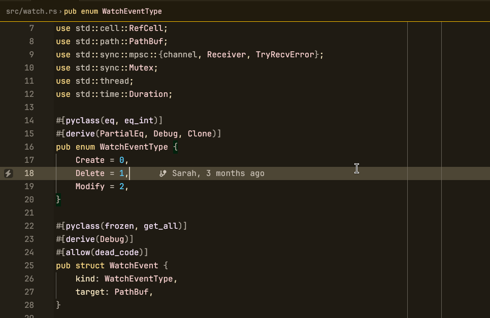
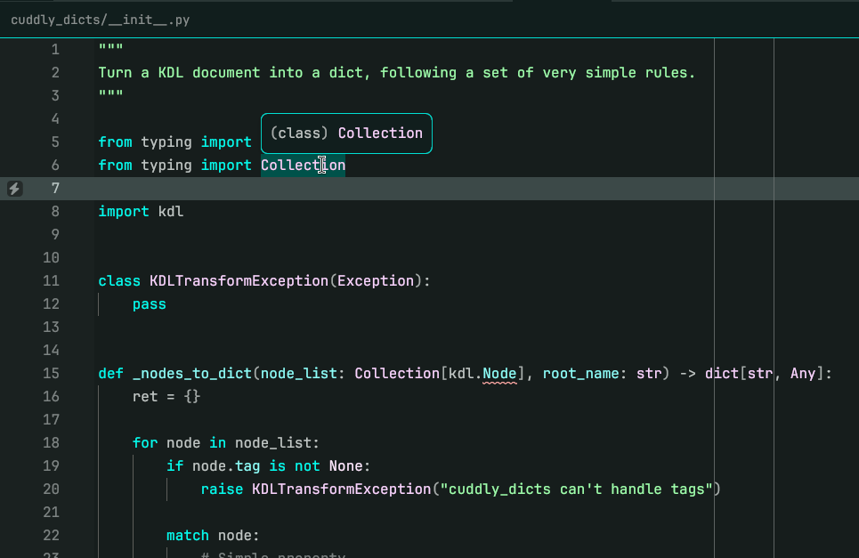
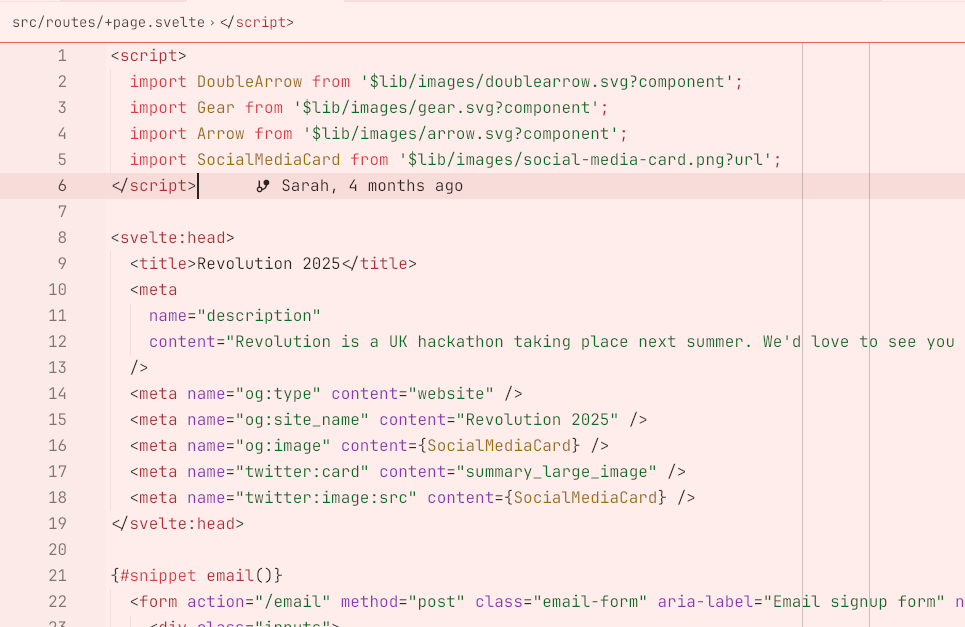

# zed-hct-theme-maker

zed-hct-theme-maker is, surprisingly, a tool to make Zed themes with the
HCT color space.

The below themes were all generated from the
**[same file.](material.kdl)**


*Not Material Dark Yellow opened on
[wakapi-anyide](https://github.com/iamawatermelo/wakapi-anyide)*


*Not Material Dark Cyan opened on
[cuddly-dicts](https://github.com/iamawatermelo/cuddly-dicts)*


*Not Material Light Red opened on
[the Revolution website](https://github.com/revolution-hacks/revolution)*

> [!NOTE]
> You can install this repository as an extension to get these themes.

## What's HCT?  
HCT stands for **hue, chroma and tone.**
- Hue is which color it is.
- Chroma is how saturated it is.
- Tone is how light/dark it is.

## Write your own themes
First, [learn KDL](https://kdl.dev/). It'll take you, like, 5 minutes.

Next, write your theme metadata:
```kdl
version 1
name "my theme"
author "me :D"
```

Then, you can write theme variants:
```kdl
variant "my theme dark" {
  appearance "dark"
  
  style {
    editor.foreground h=0 c=90 t=95
    editor.background h=0 c=90 t=5
    // .. and so on
  }
}
```

You can also use tokens, for reusability:
```kdl
token "primary" h=0 c=90

variant "my theme dark" {
  appearance "dark"
  
  style {
    editor.foreground apply="primary" t=95
    editor.background apply="primary" t=5
  }
}
```

Finally, you can also use layers for maximum composability.
```kdl
token "primary" h=0 c=90

layer "dark-tones" {
  token "fg" t=95
  token "bg" t=5
}

layer "light-tones" {
  token "fg" t=5
  token "bg" t=95
}

layer "theme" {
  style {
    // Tokens are applied in order, overriding eachother, like CSS
    // classes. Properties set on the color override any tokens.
    editor.foreground apply="primary fg"
    editor.background apply="primary bg"
  }
}

variant "my theme dark" {
  appearance "dark"
  layer "dark-tones"
  layer "theme"
}

variant "my theme light" {
  appearance "light"
  layer "light-tones"
  layer "theme"
}
```

Compile your theme with:

```sh
python3 -m zed_hct_theme_maker compile mytheme.kdl
```

Or, live-preview your theme:

```sh
python3 -m zed_hct_theme_maker experimental-patch-settings \
    mytheme.kdl \
    /path/to/settings.json \
    "My Theme Variant"
```

## Example themes

See `material.kdl` for a pastel-themed example with multiple variants
that combine layers. To customise it, change the "custom" layer
and uncomment the variants at the very bottom.